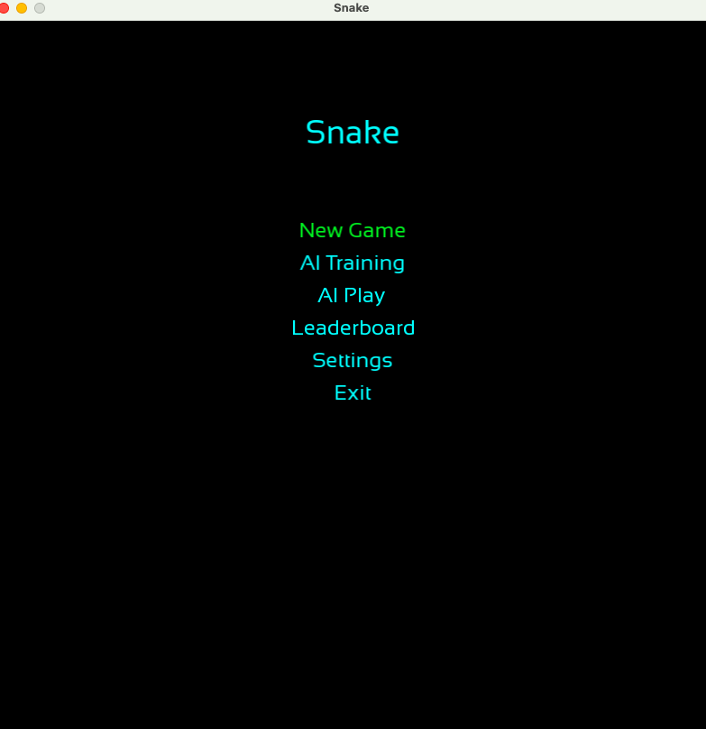
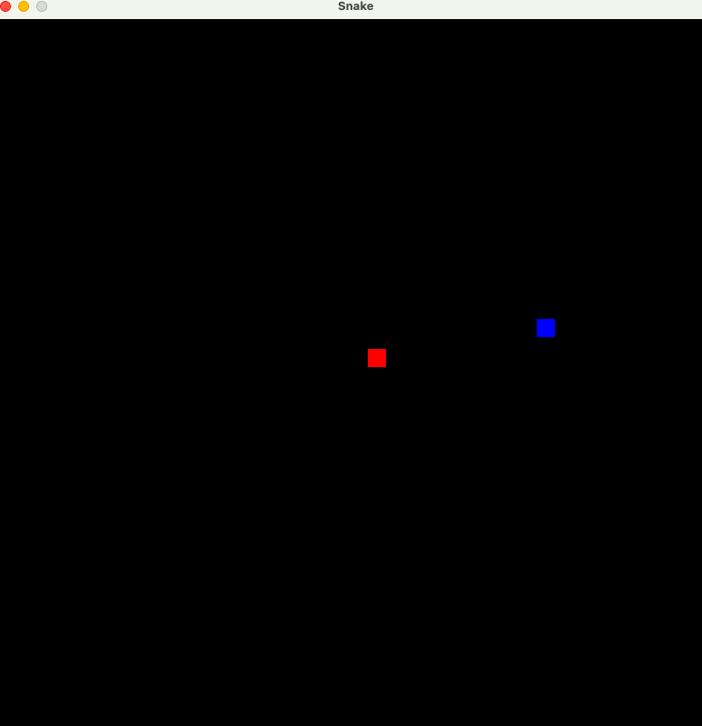
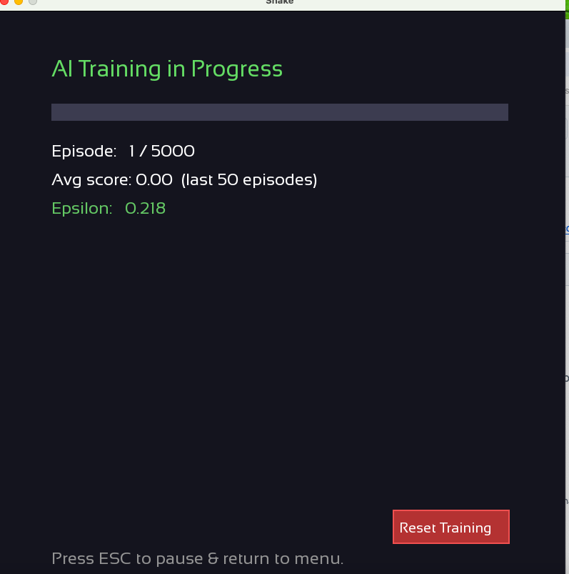

# Snake AI


[](http://www.gnu.org/licenses/gpl-3.0)

A classic Snake game built in C++ with SFML, extended with a **DQN-based AI** that can learn to play the game through reinforcement learning — all implemented from scratch with no external ML dependencies.

---

## Screenshots

| Main Menu | Gameplay |
|-----------|----------|
|  |  |


*AI Training screen — real-time progress bar, episode count, average score and epsilon value*

---

## Features

- **New Game** — Classic snake gameplay with keyboard controls
- **AI Training** — Train a DQN agent from scratch using reinforcement learning
  - Real-time training progress UI (progress bar, avg score, epsilon)
  - Auto-saves checkpoint every 100 episodes
  - Press **ESC** to pause and resume later
  - **Reset Training** button to start over
- **AI Play** — Watch the trained AI play the game
  - Prompts "model not trained" if no model file is found
- **Game Over Menu** — Choose to continue or exit after dying

---

## How the AI Works

The AI uses a **Deep Q-Network (DQN)** implemented entirely in C++ with no external ML libraries:

- **State** (8 inputs): snake head position, food position, danger flags in 4 directions
- **Network**: MLP with 2 hidden layers (64 neurons each), ReLU activations
- **Optimizer**: Adam
- **Training**: Experience replay buffer (10,000 capacity) + target network sync
- **Reward**: `+10` eat food / `-10` die / `-0.01` per step

Model weights are saved to `snake_model.bin` (~20 KB) and training checkpoints (including optimizer state and replay buffer) to `snake_checkpoint.bin` (~800 KB).

---

## Requirements

- C++ compiler with C++20 support (clang, gcc, msvc)
- CMake >= 3.16

All other dependencies (SFML, GameMenu) are fetched automatically by CMake.

---

## Building

```bash
git clone https://github.com/Lukas-Zhangjx/sfml-snake.git
cd sfml-snake
mkdir build && cd build
cmake ..
cmake --build . --target snake
```

To build the standalone headless trainer:
```bash
cmake --build . --target snake_train
```

---

## Controls

| Key | Action |
|-----|--------|
| Arrow keys | Move snake |
| ESC | Pause AI training / return to menu |

---

## Project Structure

```
src/
├── ai/
│   ├── dqn.h           # Self-contained DQN implementation
│   ├── trainer.h       # Training loop + AI Play logic
│   └── train_main.cpp  # Standalone trainer entry point
├── core/
│   ├── game.h/.cpp     # Game controller + AI interfaces
│   ├── snake.h/.cpp    # Snake entity
│   └── food.h/.cpp     # Food spawning
└── ui/
    ├── MainMenu.h/.cpp # Main menu
    └── TipWindow.h/.cpp# Game over dialog
```

---

## Credits

- Original snake game: [ParadoxZero/sfml-snake](https://github.com/ParadoxZero/sfml-snake)
- DQN implementation, AI training UI and game integration: Lukas
